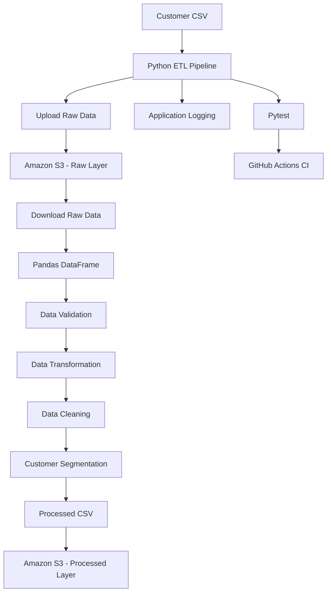
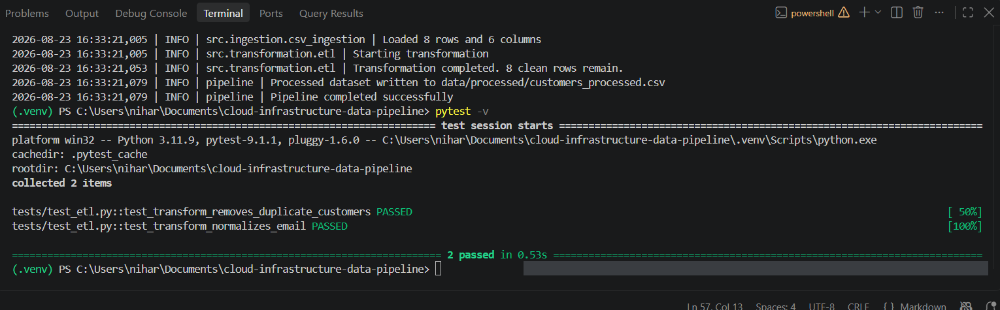
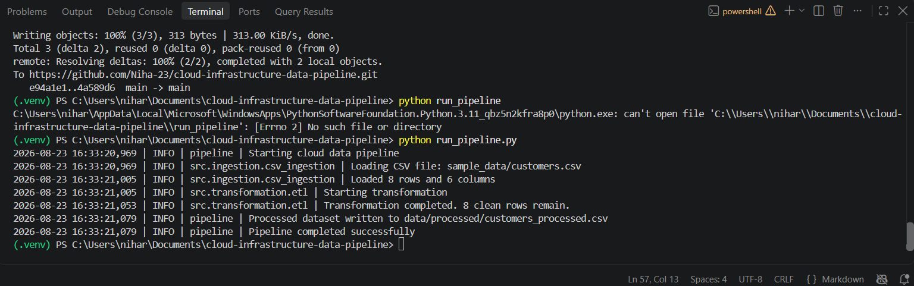

# ☁️ Cloud-Based ETL Data Engineering Pipeline

[](https://github.com/Niha-23/cloud-infrastructure-data-pipeline/actions/workflows/ci.yml)
[](https://www.python.org/)
[](https://aws.amazon.com/s3/)
[](https://pandas.pydata.org/)
[](https://pytest.org/)
[](https://github.com/features/actions)

> A modular Python ETL pipeline that ingests customer data, validates and transforms records, stores raw and processed datasets in Amazon S3, and automatically tests the application using Pytest and GitHub Actions.

---

## 📌 Overview

This project demonstrates the design and implementation of a **cloud-integrated ETL (Extract, Transform, Load) data pipeline** using Python, Pandas, Boto3, and Amazon S3.

The pipeline processes customer data through a structured workflow:

```text
Customer CSV
     │
     ▼
Python ETL Pipeline
     │
     ▼
Upload Raw Data
     │
     ▼
Amazon S3 - Raw Layer
     │
     ▼
Download Raw Data
     │
     ▼
Data Validation
     │
     ▼
Data Transformation
     │
     ▼
Customer Segmentation
     │
     ▼
Processed CSV
     │
     ▼
Amazon S3 - Processed Layer
```

The project also includes:

* Automated unit testing with Pytest
* Mocked AWS operations for CI-safe testing
* GitHub Actions continuous integration
* Environment-based configuration
* Application logging
* Modular software architecture
* Security-conscious credential handling
* Architecture documentation

---

# 🎯 Key Results

* ✅ Built an end-to-end Python ETL pipeline
* ✅ Integrated Amazon S3 using Boto3
* ✅ Implemented raw and processed data layers
* ✅ Added schema and data-quality validation
* ✅ Implemented email normalization and data cleaning
* ✅ Removed duplicate and invalid records
* ✅ Added customer spending segmentation
* ✅ Added 8 automated tests
* ✅ Added mocked S3 tests for CI
* ✅ Integrated GitHub Actions
* ✅ Separated configuration from application code
* ✅ Added application logging
* ✅ Documented the system architecture

---

# 🏗️ Architecture



For a detailed explanation of the architecture and design decisions, see:

[`docs/architecture.md`](docs/architecture.md)

---

# 🔄 ETL Workflow

## 1. Extract

The pipeline starts with the sample customer dataset:

```text
sample_data/customers.csv
```

The dataset contains:

* `customer_id`
* `name`
* `email`
* `country`
* `signup_date`
* `spend`

---

## 2. Load Raw Data to S3

The source dataset is uploaded to the Amazon S3 raw layer:

```text
raw/customers.csv
```

The raw layer preserves the source data before transformation.

---

## 3. Download and Ingest

The pipeline downloads the raw file from S3:

```text
data/raw/customers.csv
```

The ingestion logic is implemented in:

```text
src/ingestion/csv_ingestion.py
```

The ingestion layer:

* Verifies the input file exists
* Loads the CSV using Pandas
* Reports row and column counts
* Returns a Pandas DataFrame

---

## 4. Validate Data

The pipeline validates the dataset before transformation.

Required columns:

```text
customer_id
name
email
country
signup_date
spend
```

Validation includes:

* Required column validation
* Email format validation
* Numeric spend validation
* Missing-value handling
* Date conversion
* Negative-spend detection
* Duplicate customer detection

---

## 5. Transform Data

Transformation logic is implemented in:

```text
src/transformation/etl.py
```

### Email Normalization

Email addresses are converted to lowercase and stripped of unnecessary whitespace.

```text
 USER@EXAMPLE.COM
```

becomes:

```text
user@example.com
```

### Text Cleaning

Whitespace is removed from:

* Customer names
* Countries
* Email addresses

### Date Conversion

Signup dates are converted into Pandas datetime values.

Invalid dates are converted safely and handled during validation.

### Numeric Conversion

Customer spending values are converted to numeric values.

Invalid numeric values are identified and handled.

### Duplicate Removal

Duplicate customers are removed using:

```text
customer_id
```

### Invalid Record Removal

Records missing required values are excluded from the final processed dataset.

### Negative Spend Removal

Negative spending values are excluded from the processed dataset.

---

# 💰 Customer Segmentation

The pipeline creates customer segments based on spending.

| Segment |    Spending Range |
| ------- | ----------------: |
| Low     |       $0 – < $500 |
| Medium  |   $500 – < $1,000 |
| High    | $1,000 – < $2,000 |
| Premium |           $2,000+ |

This demonstrates how an ETL pipeline can perform both **data quality processing** and **business-oriented transformation**.

---

# ☁️ Amazon S3 Architecture

Amazon S3 provides the cloud storage layer.

The project uses two logical data layers:

```text
cloud-infrastructure-data-pipeline-niharika
│
├── raw/
│   └── customers.csv
│
└── processed/
    └── customers_processed.csv
```

### Raw Layer

```text
raw/customers.csv
```

Stores the original source dataset.

### Processed Layer

```text
processed/customers_processed.csv
```

Stores the validated and transformed dataset.

This separation provides a simple foundation for a **data-lake-style architecture**.

---

# 💾 Local Data Flow

During pipeline execution, local copies are maintained:

```text
sample_data/
└── customers.csv
        │
        ▼
data/raw/
└── customers.csv
        │
        ▼
ETL Transformation
        │
        ▼
data/processed/
└── customers_processed.csv
```

The processed file is then uploaded to the S3 processed layer.

---

# 🛠️ Technology Stack

| Technology         | Purpose                                |
| ------------------ | -------------------------------------- |
| **Python 3.11+**   | Core programming language              |
| **Pandas**         | Data loading and transformation        |
| **Boto3**          | AWS SDK for Python                     |
| **Amazon S3**      | Cloud object storage                   |
| **Pytest**         | Automated testing                      |
| **unittest.mock**  | Mocking AWS operations                 |
| **Git**            | Version control                        |
| **GitHub**         | Source-code hosting                    |
| **GitHub Actions** | Continuous integration                 |
| **python-dotenv**  | Environment configuration              |
| **Python Logging** | Application monitoring and diagnostics |

---

# 📂 Project Structure

```text
cloud-infrastructure-data-pipeline/
│
├── .github/
│   └── workflows/
│       └── ci.yml
│
├── docs/
│   ├── architecture.md
│   └── images/
│       ├── pipeline-run.png
│       └── tests-passed.png
│
├── sample_data/
│   └── customers.csv
│
├── src/
│   ├── ingestion/
│   │   ├── __init__.py
│   │   └── csv_ingestion.py
│   │
│   ├── storage/
│   │   ├── __init__.py
│   │   └── s3.py
│   │
│   ├── transformation/
│   │   ├── __init__.py
│   │   └── etl.py
│   │
│   ├── config.py
│   └── logger.py
│
├── tests/
│   ├── __init__.py
│   ├── test_etl.py
│   └── test_s3.py
│
├── .env.example
├── .gitignore
├── LICENSE
├── README.md
├── requirements.txt
└── run_pipeline.py
```

---

# 📁 Component Responsibilities

### `src/ingestion/`

Handles loading source CSV data into Pandas.

### `src/transformation/`

Contains:

* Validation
* Cleaning
* Transformation
* Duplicate removal
* Customer segmentation

### `src/storage/`

Contains Amazon S3 integration using Boto3.

### `src/config.py`

Loads environment-based configuration.

### `src/logger.py`

Provides application logging.

### `tests/`

Contains automated unit tests for ETL and S3 functionality.

### `sample_data/`

Contains reproducible input data.

### `docs/`

Contains architecture documentation and project screenshots.

### `.github/workflows/`

Contains the GitHub Actions CI workflow.

---

# ⚙️ Configuration

Environment-specific configuration is managed using environment variables.

The application uses:

```text
AWS_REGION
S3_BUCKET_NAME
S3_RAW_PREFIX
S3_PROCESSED_PREFIX
```

Example:

```env
AWS_REGION=us-east-2
S3_BUCKET_NAME=your-bucket-name
S3_RAW_PREFIX=raw/
S3_PROCESSED_PREFIX=processed/
```

A configuration template is provided:

```text
.env.example
```

The actual `.env` file should remain local and must not be committed to Git.

---

# 🔐 Security

The project follows basic cloud security practices.

* AWS credentials are not hard-coded in Python source files.
* `.env` is excluded using `.gitignore`.
* Environment variables are used for configuration.
* AWS operations are performed through Boto3.
* S3 operations are mocked during CI testing.
* GitHub Actions does not require personal AWS credentials to run the unit test suite.
* Production deployments should use IAM roles and temporary credentials where possible.

> **Never commit AWS access keys, secret keys, passwords, API keys, or other credentials to GitHub.**

---

# 🚀 Getting Started

## Prerequisites

Install:

* Python 3.11+
* Git
* An AWS account
* An Amazon S3 bucket
* AWS credentials configured through a supported AWS credential provider

---

## 1. Clone the Repository

```bash
git clone https://github.com/Niha-23/cloud-infrastructure-data-pipeline.git
cd cloud-infrastructure-data-pipeline
```

---

## 2. Create a Virtual Environment

### Windows

```powershell
python -m venv .venv
.venv\Scripts\Activate.ps1
```

### macOS / Linux

```bash
python3 -m venv .venv
source .venv/bin/activate
```

---

## 3. Install Dependencies

```bash
pip install -r requirements.txt
```

---

## 4. Configure Environment Variables

Create `.env` from the provided template.

### Windows

```powershell
copy .env.example .env
```

### macOS / Linux

```bash
cp .env.example .env
```

Update the values:

```env
AWS_REGION=us-east-2
S3_BUCKET_NAME=your-bucket-name
S3_RAW_PREFIX=raw/
S3_PROCESSED_PREFIX=processed/
```

---

# ☁️ AWS Setup

The pipeline requires an Amazon S3 bucket.

The configured bucket should contain or support the following logical prefixes:

```text
raw/
processed/
```

The pipeline uploads and retrieves objects using these prefixes.

No AWS credentials should be stored inside the repository.

---

# ▶️ Running the Pipeline

From the project root:

```powershell
python run_pipeline.py
```

The pipeline executes:

```text
Customer CSV
     │
     ▼
Upload Raw Data
     │
     ▼
Amazon S3 - Raw
     │
     ▼
Download Raw Data
     │
     ▼
Load with Pandas
     │
     ▼
Validate
     │
     ▼
Transform
     │
     ▼
Customer Segmentation
     │
     ▼
Save Processed CSV
     │
     ▼
Upload to S3 - Processed
     │
     ▼
Pipeline Complete
```

---

# 📊 Pipeline Output

The processed dataset is saved locally:

```text
data/processed/customers_processed.csv
```

It is also uploaded to:

```text
processed/customers_processed.csv
```

The application logs important execution events including:

* Pipeline start
* S3 upload
* S3 download
* Data loading
* Transformation
* Input/output row counts
* Processed data upload
* Pipeline completion
* Operational errors

---

# 🧪 Testing

The project uses **Pytest** for automated testing.

Run the complete test suite:

```powershell
pytest
```

For detailed output:

```powershell
pytest -v
```

## Test Coverage

The current test suite contains **8 automated tests** covering:

### ETL

* Duplicate customer removal
* Email normalization
* Customer segmentation
* Missing required columns
* Invalid spend handling

### S3

* S3 storage behavior
* File existence checks
* File download behavior

AWS operations are mocked using:

```python
unittest.mock
```

This allows the test suite to run without requiring AWS credentials.

---

# ✅ Test Results

The current project test suite passes successfully:

```text
8 passed
```

The repository also uses GitHub Actions to automatically execute the test suite.

### Local Test Execution



---

# 🔄 Continuous Integration

GitHub Actions is configured through:

```text
.github/workflows/ci.yml
```

The workflow runs when:

* Code is pushed to `main`
* A pull request targets `main`

The CI workflow performs:

```text
Push / Pull Request
        │
        ▼
Checkout Repository
        │
        ▼
Set Up Python
        │
        ▼
Install Dependencies
        │
        ▼
Run Pytest
        │
        ▼
Pass / Fail
```

This provides automated regression testing for repository changes.

---

# 📸 Pipeline Execution

Example pipeline execution:



---

# 🧪 Testing Strategy

The project intentionally separates application logic from external cloud dependencies.

### Unit Testing

ETL logic is tested independently using Pytest.

### Mocked Cloud Operations

S3 interactions are mocked using `unittest.mock`.

### CI Safety

GitHub Actions can execute the test suite without access to personal AWS credentials.

This approach provides:

* Faster tests
* Repeatable tests
* Safer CI execution
* Isolation from external infrastructure

---

# 📝 Logging

Application logging is implemented in:

```text
src/logger.py
```

The pipeline records important execution events such as:

```text
Starting customer data pipeline.
Uploading raw data to S3.
Downloading raw data from S3.
Loading CSV file.
Transforming customer records.
Saving processed data.
Uploading processed data to S3.
Pipeline completed successfully.
```

Logging also records input/output row counts and operational errors.

---

# 🧩 Engineering Practices

The project follows several software engineering principles.

### Modular Architecture

The application separates:

* Configuration
* Data ingestion
* Data transformation
* Cloud storage
* Logging
* Testing

### Separation of Concerns

S3 operations are separated from transformation logic.

### Configuration Management

Environment-specific settings are externalized through environment variables.

### Automated Testing

Core ETL and storage behavior is covered by automated tests.

### Continuous Integration

GitHub Actions automatically runs the test suite.

### Reproducibility

Sample data and dependency definitions allow the project to be recreated in another development environment.

### Cloud Integration

Boto3 provides the interface between the Python application and Amazon S3.

---

# 📈 Current Capabilities

| Capability                             | Status |
| -------------------------------------- | :----: |
| Python ETL pipeline                    |    ✅   |
| CSV ingestion                          |    ✅   |
| Schema validation                      |    ✅   |
| Data cleaning                          |    ✅   |
| Email normalization                    |    ✅   |
| Date conversion                        |    ✅   |
| Spend validation                       |    ✅   |
| Duplicate removal                      |    ✅   |
| Customer segmentation                  |    ✅   |
| Amazon S3 integration                  |    ✅   |
| Raw data storage                       |    ✅   |
| Processed data storage                 |    ✅   |
| Application logging                    |    ✅   |
| Automated Pytest tests                 |    ✅   |
| Mocked S3 tests                        |    ✅   |
| GitHub Actions CI                      |    ✅   |
| Environment-based configuration        |    ✅   |
| Security-conscious credential handling |    ✅   |
| Architecture documentation             |    ✅   |

---

# ☁️ Future Cloud Engineering Roadmap

The current implementation provides a foundation that can evolve into a more production-oriented cloud data platform.

Potential future architecture:

```text
                    Data Source
                        │
                        ▼
                 Amazon S3 Raw
                        │
                        ▼
                  ETL Processing
                        │
              ┌─────────┴─────────┐
              │                   │
              ▼                   ▼
         Validation         Transformation
              │                   │
              └─────────┬─────────┘
                        ▼
               Amazon S3 Processed
                        │
                        ▼
                  Analytics Layer
```

Potential future AWS capabilities include:

* AWS Lambda
* Amazon EventBridge
* AWS Glue
* Amazon CloudWatch
* IAM role-based authentication
* Infrastructure as Code with Terraform
* Data cataloging
* Data-quality monitoring
* Workflow orchestration
* Analytics and BI integration

These are **future enhancements and are not currently part of the implementation**.

---

# 🚀 Future Improvements

Planned improvements include:

* [ ] Increase automated test coverage
* [ ] Add test coverage reporting
* [ ] Add advanced data-quality checks
* [ ] Add structured logging
* [ ] Add pipeline metrics
* [ ] Add CloudWatch monitoring
* [ ] Add automated scheduling
* [ ] Add AWS Lambda execution
* [ ] Add EventBridge scheduling
* [ ] Add Terraform infrastructure
* [ ] Add Parquet output
* [ ] Add data-quality reporting
* [ ] Add analytics/BI integration
* [ ] Add pipeline alerting

---

# 🎓 Skills Demonstrated

### Programming

* Python
* Pandas
* Modular programming
* Exception handling
* Environment configuration
* Logging

### Data Engineering

* ETL pipeline design
* Data ingestion
* Data validation
* Data cleaning
* Data transformation
* Data quality
* Customer segmentation
* Raw and processed data layers

### Cloud

* AWS
* Amazon S3
* Boto3
* Cloud storage architecture
* AWS configuration
* Cloud security fundamentals

### Testing

* Pytest
* Unit testing
* Mocking
* Test isolation
* Regression testing

### DevOps

* Git
* GitHub
* GitHub Actions
* Continuous Integration
* CI/CD concepts

### Software Engineering

* Modular architecture
* Separation of concerns
* Configuration management
* Logging
* Documentation
* Reproducible development environments
* Version control

---

# 💡 Why This Project?

This project demonstrates how a data-processing application can be designed as a maintainable cloud-integrated system rather than a simple standalone script.

It combines:

* Python development
* Data engineering
* Cloud storage
* Data quality
* Automated testing
* Continuous integration
* Configuration management
* Security practices
* Technical documentation

The modular architecture provides a foundation for evolving the project into a larger cloud-native data platform.

---

# 👩‍💻 Author

## Niharika

**Software Engineer | Cloud & Data Engineering**

GitHub: [@Niha-23](https://github.com/Niha-23)

---

# 📄 License

This project is licensed under the **MIT License**.

See the [`LICENSE`](LICENSE) file for details.

---

⭐ If you find this project useful, feel free to explore the repository and follow its development.
