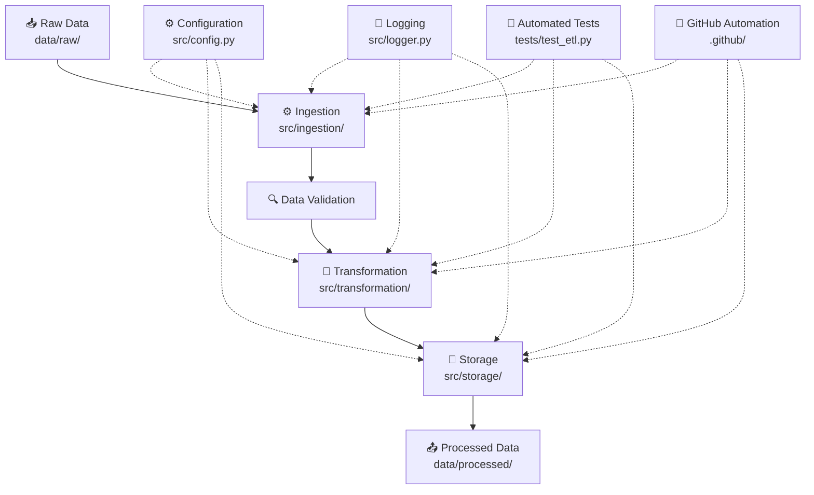

# ☁️ Cloud-Based ETL Data Engineering Pipeline
[](https://github.com/Niha-23/cloud-infrastructure-data-pipeline/actions/workflows/ci.yml)
> An end-to-end Python ETL pipeline designed to extract, validate, transform, and load data while following production-oriented software engineering practices.


---

## 📌 Overview

This project demonstrates the development of a structured **ETL (Extract, Transform, Load) data pipeline using Python**.

The pipeline is designed to take raw data through a series of controlled processing stages, apply validation and transformation logic, and produce clean, structured output suitable for downstream analytics and data workflows.

The project follows a modular architecture with separate components for configuration, data processing, testing, documentation, and pipeline execution.

### Key objectives

* Build a reusable ETL pipeline using Python
* Separate extraction, transformation, and loading responsibilities
* Implement data validation and quality checks
* Organize the project using a maintainable software structure
* Include automated testing with Pytest
* Use environment-based configuration
* Provide sample data for reproducible testing
* Prepare the project for future cloud integration

---

## 🏗️ Pipeline Architecture



---

## 🔄 ETL Workflow

### 1. Extract

The pipeline reads data from the configured input source and prepares it for processing.

The project includes sample data so that the pipeline can be executed and tested in a reproducible environment.

### 2. Validate

Input data is checked before transformation.

Validation helps identify issues such as:

* Missing or invalid values
* Unexpected data formats
* Invalid records
* Incorrect data structures
* Data quality issues

### 3. Transform

Validated data is processed through transformation logic designed to produce a cleaner and more consistent dataset.

Depending on the configured pipeline, transformations may include:

* Data cleaning
* Standardization
* Type conversion
* Field transformation
* Record filtering
* Data normalization

### 4. Load

The transformed data is written to the configured output destination.

The modular design allows the loading layer to be extended for additional storage systems and cloud-based destinations.

---

## 🛠️ Technology Stack

| Technology                | Purpose                                 |
| ------------------------- | --------------------------------------- |
| **Python**                | Core ETL and data-processing language   |
| **Pytest**                | Automated testing                       |
| **Git**                   | Version control                         |
| **GitHub**                | Source-code management                  |
| **Environment Variables** | Configuration and secrets management    |
| **AWS**                   | Cloud integration target                |
| **.venv**                 | Isolated Python development environment |

---

## 📂 Project Structure

```text
cloud-data-engineering-pipeline/
│
├── .github/
│   └── workflows/
│       └── ...
│
├── data/
│   ├── raw/
│   └── processed/
│
├── docs/
│   └── ...
│
├── sample_data/
│   └── ...
│
├── src/
│   └── ...
│
├── tests/
│   └── ...
│
├── .env.example
├── .gitignore
├── config
├── README.md
├── requirements.txt
└── run_pipeline
```

### Directory responsibilities

**`src/`**

Contains the core application and ETL processing logic.

**`data/`**

Contains data used by the pipeline and/or generated pipeline outputs.

**`sample_data/`**

Contains sample input data used for development and testing.

**`tests/`**

Contains automated tests for validating pipeline functionality.

**`docs/`**

Contains supporting project documentation.

**`.github/`**

Contains GitHub-related configuration and workflow automation.

**`.env.example`**

Provides an example of environment variables required by the application without exposing actual credentials or secrets.

**`config`**

Contains project configuration used by the pipeline.

**`run_pipeline`**

Provides the pipeline execution entry point.

---

## ⚙️ Getting Started

### Prerequisites

Before running the project, make sure you have:

* Python 3.x
* Git
* A terminal or command prompt

---

## 1. Clone the repository

```bash
git clone https://github.com/Niha-23/cloud-infrastructure-data-pipeline.git
```

Navigate into the project:

```bash
cd cloud-infrastructure-data-pipeline
```

---

## 2. Create a virtual environment

On Windows:

```bash
python -m venv .venv
```

Activate it:

```bash
.venv\Scripts\activate
```

On macOS/Linux:

```bash
python3 -m venv .venv
source .venv/bin/activate
```

---

## 3. Install dependencies

```bash
pip install -r requirements.txt
```

---

## 4. Configure environment variables

Create your local environment configuration from the example file.

```bash
copy .env.example .env
```

For macOS/Linux:

```bash
cp .env.example .env
```

Update `.env` with your local configuration.

> **Important:** Never commit `.env` or credentials, API keys, passwords, or other secrets to GitHub.

---

## ▶️ Running the Pipeline

The project includes a dedicated pipeline execution entry point.

Run the pipeline using:

```bash
python run_pipeline
```

If your local project uses a different execution command, refer to the implementation in `run_pipeline`.

The general workflow is:

```text
Input Data
    ↓
Extraction
    ↓
Validation
    ↓
Transformation
    ↓
Output
```
### Pipeline Execution

Example successful pipeline execution:


---

## 🧪 Running Tests

The project uses **Pytest** for automated testing.

Run:

```bash
pytest
```

For more detailed output:

```bash
pytest -v
```

Testing helps verify that the pipeline components behave as expected and reduces the risk of introducing regressions when the project is modified.
### Test Execution

The pipeline includes automated tests using Pytest.


---

## 🔐 Configuration & Security

The project uses environment-based configuration to avoid hard-coding sensitive information.

The repository includes:

```text
.env.example
```

while the actual:

```text
.env
```

should remain local and should not be committed.

The `.gitignore` file is used to prevent local environments, caches, generated files, and sensitive configuration from being accidentally committed.

---

## 🧩 Engineering Practices

This project demonstrates several software engineering practices commonly used in real-world data projects:

### Modular Design

ETL responsibilities are separated into reusable components rather than placing the entire pipeline into one script.

### Configuration Management

Environment-specific settings are separated from application logic.

### Automated Testing

Pytest is used to validate pipeline functionality.

### Version Control

Git is used to track changes and GitHub is used for source-code management.

### Reproducibility

Sample data and dependency definitions make it easier to reproduce the development environment.

### Security Awareness

Sensitive configuration is managed through environment variables rather than being stored directly in source code.

---

## ☁️ Cloud Engineering Roadmap

The project architecture is designed so that the pipeline can be extended into a cloud-based data engineering solution.

Potential future architecture:

```text
                 Raw Data
                    │
                    ▼
              AWS S3 Bucket
                    │
                    ▼
              Python ETL
                    │
          ┌─────────┴─────────┐
          ▼                   ▼
      Validation          Transformation
          │                   │
          └─────────┬─────────┘
                    ▼
             Processed Data
                    │
                    ▼
               AWS S3
                    │
                    ▼
          Analytics / BI Layer
```

Potential future enhancements include:

* AWS S3 integration
* AWS Lambda
* AWS Glue
* CloudWatch monitoring
* Database integration
* Pipeline orchestration
* CI/CD automation
* Infrastructure as Code
* Data-quality monitoring
* Data visualization

---

## 📈 Future Improvements

Planned improvements include:

* [ ] Expand automated test coverage
* [ ] Add structured logging
* [ ] Add stronger data-quality validation
* [ ] Add AWS S3 integration
* [ ] Add cloud-based pipeline execution
* [ ] Add monitoring and alerting
* [ ] Implement CI/CD through GitHub Actions
* [ ] Add data visualization
* [ ] Add pipeline performance metrics
* [ ] Introduce workflow orchestration

---

## 🎯 Skills Demonstrated

This project demonstrates practical experience with:

**Programming**

* Python
* Modular programming
* Exception handling
* Configuration management

**Data Engineering**

* ETL pipeline design
* Data extraction
* Data validation
* Data transformation
* Data quality
* Pipeline execution

**Testing**

* Pytest
* Automated testing
* Test-driven validation

**Cloud & DevOps**

* AWS cloud concepts
* Environment configuration
* Git
* GitHub
* GitHub workflow automation
* CI/CD concepts

**Software Engineering**

* Project structure
* Modular architecture
* Documentation
* Version control
* Reproducible development environments

---

## 💡 Why This Project?

Data engineering requires more than simply writing scripts to manipulate data.

This project focuses on building a maintainable pipeline with clear separation of responsibilities, automated testing, configuration management, and a structure that can evolve from a local development environment toward cloud infrastructure.

The project provides a foundation for future expansion into a fully cloud-native ETL architecture.

---

## 👩‍💻 Author

### Niharika

Software Engineer | Cloud & Data Engineering

GitHub: [Niha-23](https://github.com/Niha-23)

---

## ⭐ Project

If you find this project useful, feel free to explore the repository and follow the development of the pipeline as it evolves toward a cloud-based data engineering architecture.
